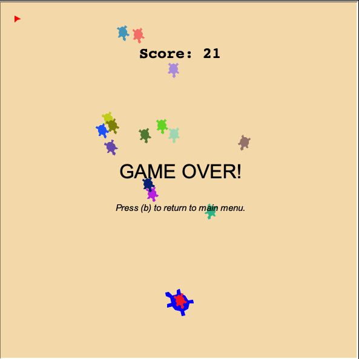

# Project 6 - Space Invaders

This is a classic Space Invaders game developed using Python.

<p align="center" >
     
</p> 

## Authors:

-   Weijie XI (id:3037899698)
-   Lidia Sun (id: 3038230015)

### TA: Imen

## Intro 

Space Invaders is a classic arcade game where the player controls a spaceship and fires at invading aliens. The objective is to defeat as many aliens as possible while avoiding their attacks. Our version of the game has been modified to allow the player to control a turtle and fire missiles at invading turtles instead of aliens.

## Project Approval

We are struggle to get approval but missed the deadline due to we are very new to computer. We have this final more interactive version by the suggestion by our TA's advice. Thanks Imen.

## Instructions

To start the game, you will need to have Python installed on your computer. then, git clone (https://github.com/ucb-courses/cs10-proj-6) or [download](https://beatlesm.s3.us-west-1.amazonaws.com/cs10/WeijieXi_LidiaSun_FinalProject.zip) zipped files:

```
git clone git@github.com:ucb-courses/cs10-proj-6.git
```

Once you have unzipped (or git clone) the repository, navigate to the project directory and run the following command to start the game:

```
python3 __main__.py
```

## The game manual

There are on-line `view the instruction manual` option on main page: 

-   `space bar`: to make firing turtle fires missiles.
-   `right arrow` key: to move firing turtle toward left.
-   `left arrow` key: to move firing turtle toward right.

## Features

The game includes the following features:

-   `Invading Turtles` - Randomly generated turtles that move down the screen towards the player turtle.
-   `Player Turtle` - Controlled by the user to move left and right, and fire missiles at the invading turtles.
-   `Missile Firing` - The player turtle can fire missiles at the invading turtles to destroy them.

## Justification for Complexity

Our project should receive full credit for complexity because we utilized a number of advanced concepts taught in class, such as object-oriented programming and collision detection. We also broke up complex tasks into smaller sub-tasks, such as creating the invading turtles and moving them, and implementing the missile firing functionality.

## Lists & Script Variables 

Our project uses a number of lists and script variables to keep track of game elements such as the invading turtles and the missiles fired by the player turtle. These lists are non-trivial because they are constantly being updated as the game progresses, and their contents need to be checked for collisions with other game elements.

## Function Table

We created several custom functions to implement the game logic and control the behavior of the game objects. Here's a table describing the functionality of each function:

| Block / Function Name | Domain (inputs)                               | Range (outputs) | Behavior (role in the context of the project)                                          |
| :-------------------- | :----------------------- | :-------------- | :---------------------------------------------------------------------------------------------------------- |
| `create_invader()`    |  None                    |  None           |  Generates a new invading turtle and adds it to the list of invading turtles.                               |
| `move()`              |  None                    |  None           |  Moves all of the invading turtles down the screen towards the player turtle.                               |
| `fire()`              |  None                    |  None           |  Creates a new missile object and adds it to the list of missiles fired by the player turtle.               |
| `check_collision()`   |  None                    |  Boolean        |  Checks if any of the missiles fired by the player turtle have collided with any of the invading turtles.   |


## Bug Writeup (optional)

We did not encounter any major bugs in our game during development. However, we did notice a few minor issues with the collision detection logic that we were able to fix before the project deadline. We also received some feedback from our classmates regarding the game difficulty and pacing, which we used to make some minor adjustments to the game mechanics. Overall, we believe that our game is a fun and engaging implementation of the classic Space Invaders game play.

## About the unit tests

We have included three test files to ensure that the code is functioning properly. Below is an explanation of each test file:

1.   `test_scoreboard.py` - Tests the Scoreboard class in scoreboard.py. This file includes four tests that check whether the initial score is 0, whether the `increase_score` method works as expected, whether the `write_score` method returns the correct string, and whether the `game_over` method returns the correct string.

-   To run test `test_scoreboard.py`

```
python3 -m unittest test_scoreboard.py
```

2.   `test_player.py` - Tests the Player class in `player.py`. This file includes three tests that check whether the player turtle turns left and right correctly, whether the create_missile method creates a new missile with the correct attributes, and whether the fire method moves all missiles in the missiles list forward by the correct amount.

-   To run test `test_player.py`

```
python3 -m unittest test_player.py
```

3.   `test_invader.py` - Tests the Invader class in `invader.py`. This file includes two tests that check whether the create_invader method creates new invaders and adds them to the `enemies list`, and whether the move method moves all invaders in the enemies list forward by the correct amount.

-   To run test `test_invader.py`

```
python3 -m unittest test_invader.py
```

Overall, these tests ensure that each class is working as intended, which increases the reliability and accuracy of the program.
